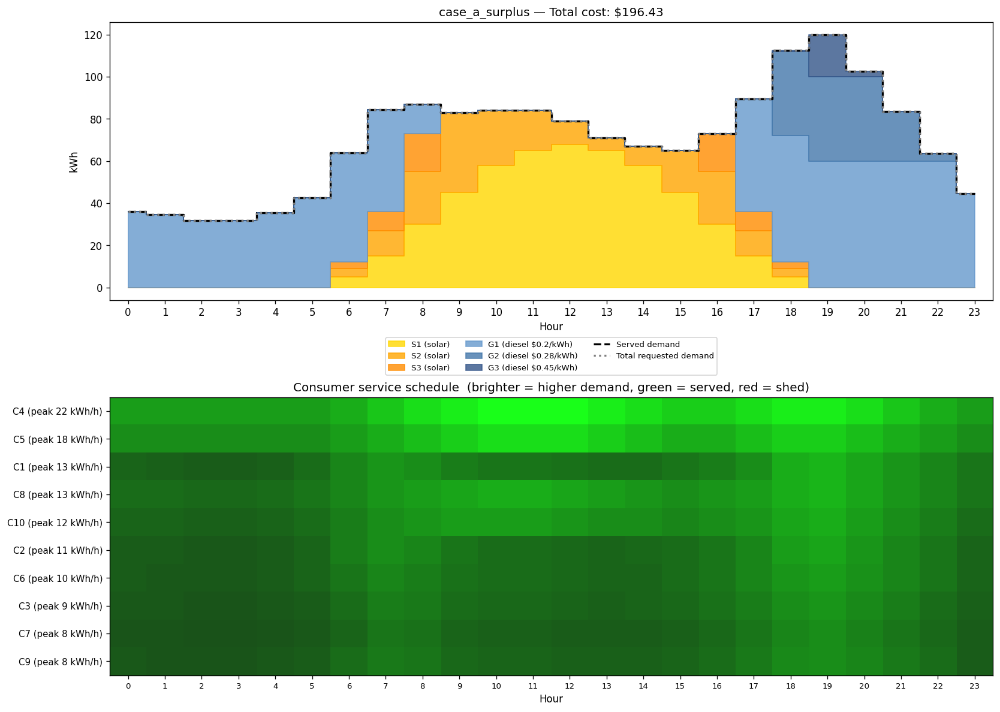
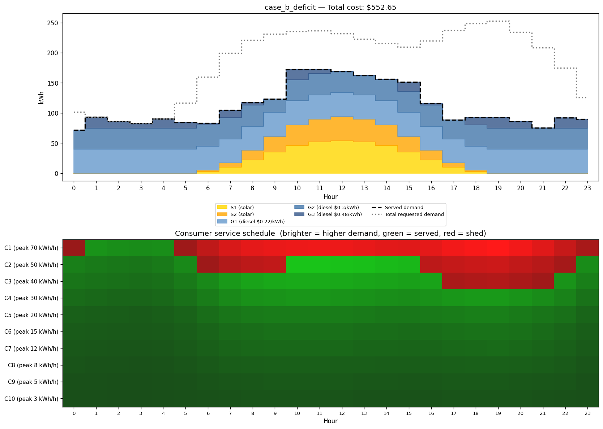

# Симулятор энергосети

## Обзор

24-часовой симулятор энергосети, который составляет расписание работы дизельных и солнечных генераторов для обслуживания потребителей с минимальными затратами. На каждый час симулятор решает, какие генераторы включить (и на каком уровне мощности) и каких потребителей подключить, оптимизируя лексикографически: сначала максимизировать количество обслуженных потребителей, а затем — при данном максимуме — минимизировать суммарные затраты на генерацию. Реализованы два солвера: точный MILP (PuLP/CBC) и жадный алгоритм для перекрёстной проверки.

---

## Запуск

**Требования:** Python 3.11+, [`uv`](https://docs.astral.sh/uv/).

```bash
# Установить зависимости
uv sync

# Запустить MILP-солвер на обоих сценариях
uv run python main.py testcases/case_a_surplus.json
uv run python main.py testcases/case_b_deficit.json

# Запустить жадный солвер
uv run python main.py testcases/case_b_deficit.json --solver greedy

# Запустить тесты
uv run pytest
```

Каждый запуск выводит почасовую сводную таблицу и сохраняет PNG-визуализацию рядом с входным файлом.

---

## Постановка задачи

### Множества

- $T = \{0, \ldots, 23\}$ — часы
- $G$ — дизельные генераторы
- $S$ — солнечные генераторы
- $C$ — потребители

### Параметры (входные данные)

- $D_{c,t} \geq 0$ — спрос потребителя $c$ в час $t$ (кВтч), задаётся в `hourly_demand`
- $P_{\max,g}$ — максимальная мощность дизельного генератора $g$ (кВт), задаётся в `max_power`
- $\text{cost}_g$ — стоимость выработки дизельного генератора $g$ (\$/кВтч), задаётся в `cost_per_kwh`
- $\text{profile}_{s,t}$ — доступная выработка солнечной панели $s$ в час $t$ (кВтч), задаётся в `generation_profile`

### Переменные (для каждого часа $t$)

- $p_{g,t} \geq 0$ — выработка дизельного генератора $g$ (кВтч)
- $u_{g,t} \in \{0,1\}$ — индикатор включения дизеля
- $v_{c,t} \in \{0,1\}$ — потребитель $c$ обслужен (бинарно, частичного обслуживания нет)
- $s_{s,t} \geq 0$ — выработка солнечной панели $s$ (допускается ограничение)

### Ограничения

**Баланс мощности:**
$$\sum_{g \in G} p_{g,t} + \sum_{s \in S} s_{s,t} = \sum_{c \in C} D_{c,t} \cdot v_{c,t}$$

**Ограничение дизеля:**
$$p_{g,t} \leq P_{\max,g} \cdot u_{g,t} \quad \forall g \in G$$

**Ограничение солнечной генерации:**
$$s_{s,t} \leq \text{profile}_{s,t} \quad \forall s \in S$$

### Лексикографическая двухэтапная оптимизация

Межвременны́х связей в модели нет (нет накопителей, нет ограничений на скорость изменения мощности), поэтому задача распадается на 24 независимых почасовых подзадачи, решаемых последовательно в два этапа:

**Этап 1** — максимизировать количество обслуженных потребителей (при всех ограничениях выше):

$$\max \sum_{c \in C} v_{c,t}$$

Обозначим оптимальное значение $V^*$.

**Этап 2** — минимизировать затраты на генерацию, зафиксировав $V^*$ (при всех исходных ограничениях плюс):

$$\min \sum_{g \in G} \mathrm{cost}_g \cdot p_{g,t}$$

$$\sum_{c \in C} v_{c,t} \geq V^*$$

---

## Подход

**Почему MILP с PuLP/CBC?** Решение о подключении потребителя бинарное (включён/выключен), что делает задачу задачей смешанного целочисленного линейного программирования. PuLP предоставляет удобный Python-интерфейс, а встроенный солвер CBC решает задачи такого масштаба (десятки переменных на час) за миллисекунды без дополнительной установки.

**Почему лексикографический подход, а не взвешенная сумма или Big-M?** Взвешенная целевая функция вида $\alpha \cdot N_{\text{served}} - \beta \cdot \text{cost}$ требует подбора весов и даёт разные компромиссы в зависимости от масштаба слагаемых. Формулировка с Big-M вносит большой коэффициент, который ухудшает числовую обусловленность LP-релаксации. Двухэтапный подход точен и численно устойчив: этап 1 фиксирует максимальное число обслуженных, этап 2 минимизирует затраты в пределах этого ограничения.

**Почему 24 независимых подзадачи?** В модели нет межвременны́х ограничений: нет заряда накопителя, нет ограничений на скорость изменения мощности, нет минимального времени работы/простоя, нет пусковых затрат. Решение каждого часа зависит только от профилей генерации и спроса в этот час, поэтому суточный горизонт тривиально распадается на 24 независимые задачи — это даёт ускорение в 24 раза и сохраняет каждую MILP-задачу небольшой.

**Почему жадный алгоритм тоже оптимален?** Для целевой функции максимизации числа обслуженных при одном ограничении на мощность и бинарных переменных потребителей задача является вариантом задачи о рюкзаке, где все «ценности» равны (каждый потребитель считается за 1). В этом случае сортировка потребителей по возрастанию спроса и жадный выбор оптимальны: любая замена выбранного потребителя на более «дорогого» не увеличивает счётчик (аргумент обмена — меньший потребитель помещается всегда, когда помещается больший, но не наоборот). Для целевой функции затрат при фиксированном наборе обслуженных потребителей диспетчеризация генераторов в порядке возрастания стоимости (merit order) также оптимальна по аналогичному аргументу. Жадный солвер включён как быстрая перекрёстная проверка MILP.

---

## Тестовые сценарии

### Сценарий A: избыток + «утиная кривая»

Десять потребителей с реалистичными жилыми и промышленными профилями спроса (утренний всплеск, низкий дневной спрос, вечерний пик 18:00–22:00). Три солнечные панели с колоколообразным профилем, пиком в час 13, обеспечивают суммарную дневную выработку ~167 кВтч, превышающую суммарный дневной спрос (~79 кВтч) — на графике видно ограничение генерации. Три дизельных генератора (60/40/30 кВт, $0.20/0.28/0.45 за кВтч) полностью покрывают вечерний пик без солнца. **Отключений не происходит** ни в один час. В часы 9–16 дизели не работают; вечером включается только самый дешёвый дизель.



### Сценарий B: дефицит мощности в пиковый час

Десять потребителей разного размера. Три дизельных генератора суммарной мощностью 100 кВт и две небольшие солнечные панели. В час 19 солнечная выработка равна нулю, а суммарный спрос потребителей (~253 кВтч) значительно превышает мощность дизелей (100 кВт). Солвер вынужден отключить трёх потребителей — задача нетривиальна: отключение только самого крупного потребителя (C1, 70 кВтч) оставляет спрос 183 кВтч против 100 кВт мощности, поэтому солвер должен найти оптимальное подмножество для отключения.



---

## Допущения и упрощения

- **Почасовая дискретизация:** внутричасовая динамика не рассматривается.
- **Нет ограничений на скорость изменения мощности:** генераторы могут мгновенно перейти от 0 к полной мощности.
- **Нет минимального времени работы/простоя:** генераторы могут свободно включаться и выключаться каждый час.
- **Нет пусковых затрат:** их учёт связал бы часы между собой и нарушил бы разложение на независимые подзадачи.
- **Линейные затраты:** постоянная стоимость кВтч без тепловых характеристик и нелинейного потребления топлива.
- **Модель единой шины (copper-plate):** нет сетевой топологии, линий передачи и потерь. Все генераторы и потребители электрически совмещены.
- **Детерминированные прогнозы:** профили солнечной генерации и спроса считаются точно известными.
- **Все потребители равнозначны:** максимизация числа обслуженных одинаково учитывает крупный завод и небольшой дом.
- **Мгновенное отключение без штрафа:** отключение потребителя не несёт затрат в целевой функции.
- **Нет резерва:** резервный запас мощности не поддерживается.

---

## Возможные расширения

- **Накопители энергии:** добавить объекты, которые могут сохранять излишки энергии (Которая, например, генерируется солнечной панелью)
- **Взвешенные потребители:** есть более важные потребители, есть - менее
- **Пусковые затраты и минимальное время работы/простоя**
- **DC/AC оптимальный поток мощности:** сетевая топология и ограничения на линии; замена баланса по единой шине уравнениями потокораспределения.
- **Стохастическая / сценарная оптимизация:** моделирование неопределённости солнечной генерации с помощью сценарных деревьев или вероятностных ограничений.
- **Управление спросом:** потребители становятся частично гибкими (переносимые или снижаемые нагрузки).
- **Скользящий горизонт (MPC):** пересчёт каждый час с обновлёнными прогнозами и состоянием накопителя.
- **Проверка на реальных данных**

---

## Использование ИИ

- **Gemini Deep Research** использовался для изучения класса задач (Unit Commitment + Economic Dispatch + Load Shedding), подтверждения применимости почасовой декомпозиции при данных допущениях и выбора библиотек (PuLP/CBC в сравнении с другими солверами).

  > Мне нужно глубокое исследование по задаче "Симулятор энергосети" (unit commitment / economic dispatch на 24 часа). Цель исследования — собрать материал, на основе которого я смогу написать решение на Python 3, оформить репозиторий и ответить на концептуальные вопросы.
  >
  > КОНТЕКСТ ЗАДАЧИ
  > Дано на сутки (24 часа):
  > - Список потребителей с почасовым потреблением (кВт·ч).
  > - Список генераторов двух типов:
  >   (а) Диспетчируемые (дизель): постоянная максимальная мощность, высокая удельная стоимость, можно включать/выключать.
  >   (б) Недиспетчируемые (солнечные панели): почасовой профиль генерации задан, в некоторые часы = 0, низкая стоимость.
  > Нужно для каждого часа:
  > 1. Определить, какие генераторы и на какой мощности работают, чтобы покрыть спрос при минимальной стоимости.
  > 2. Если суммарной доступной генерации не хватает — отключить минимально возможное число потребителей (максимизировать число подключённых).
  > 3. Вывести: расписание работы генераторов, почасовую стоимость, список отключённых потребителей по часам.
  >
  > ЧТО Я ХОЧУ ПОЛУЧИТЬ ОТ ИССЛЕДОВАНИЯ
  >
  > 1. КЛАССИФИКАЦИЯ ЗАДАЧИ
  >    - К какому классу задач оптимизации это относится (Unit Commitment Problem, Economic Dispatch, их разница).
  >    - Формальная математическая постановка: переменные, целевая функция, ограничения. Покажи как LP, как MILP, и как двухуровневую (сначала максимизация числа потребителей, потом минимизация стоимости).
  >    - Почему задача максимизации числа подключённых потребителей при нехватке энергии — это отдельная подзадача (knapsack-подобная) и как её корректно скомбинировать с минимизацией стоимости (лексикографическая оптимизация, big-M, weighted sum — плюсы/минусы каждого подхода).
  >
  > 2. АЛГОРИТМИЧЕСКИЕ ПОДХОДЫ (от простого к сложному, с разбором применимости к этой задаче)
  >    - Жадный алгоритм (merit order dispatch): отсортировать генераторы по цене, включать пока не покроем спрос. Когда работает корректно, когда даёт неоптимум.
  >    - Перебор всех комбинаций включения генераторов по часам (для 3–5 генераторов это 2^5 = 32 варианта на час — реально ли в лоб).
  >    - Линейное программирование (LP) при непрерывной мощности.
  >    - Смешанно-целочисленное программирование (MILP) с бинарными переменными «генератор включён/выключен» и «потребитель подключён/отключён».
  >    - Декомпозиция по часам: можно ли решать каждый час независимо при отсутствии межчасовых ограничений (ramp rates, min up/down time, накопители) — и да, в базовой постановке часы независимы, это важно подчеркнуть.
  >
  > 3. PYTHON-БИБЛИОТЕКИ
  >    Сравни конкретно для этой задачи:
  >    - PuLP (с CBC по умолчанию) — простота, читаемость моделей.
  >    - scipy.optimize.linprog / milp — встроенность, ограничения.
  >    - Google OR-Tools (pywraplp, CP-SAT).
  >    - Pyomo.
  >    Для каждой: пример кода постановки задачи на 1 час для нашей формулировки, плюсы/минусы, лицензия, нужно ли ставить внешний солвер. Какую посоветуешь как разумный дефолт для собеседовательского задания (важны читаемость и минимальные зависимости).
  >
  > 4. АРХИТЕКТУРА РЕШЕНИЯ
  >    - Как разумно разложить код по модулям: модели данных (Consumer, Generator, ScheduleResult), парсер входа (JSON/YAML), решатель, форматирование вывода.
  >    - Типы генераторов через наследование vs через поле type — что лучше для расширяемости.
  >    - Как структурировать вывод (таблица по часам vs JSON).
  >    - Логирование/отладка.
  >
  > 5. ТЕСТОВЫЕ СЛУЧАИ
  >    - Как сконструировать ~10 потребителей и 3–5 генераторов так, чтобы:
  >      (а) в одном случае генерации хватало с запасом и был нетривиальный выбор «солнце днём, дизель ночью»;
  >      (б) в другом случае в пиковые часы возникал дефицит, и был интересный выбор кого отключать (когда потребители разного размера — это knapsack, а не просто «отключить любого»).
  >    - Какие edge cases стоит покрыть: нулевой спрос, нулевая генерация, потребитель крупнее любого генератора, ровно равные суммы, генерация только от солнца ночью (= 0).
  >    - Формат входных данных (предложи JSON-схему).
  >
  > 6. ДОПУЩЕНИЯ И УПРОЩЕНИЯ БАЗОВОЙ МОДЕЛИ
  >    Подробный разбор того, чего НЕ учитывает простая модель и что важно упомянуть в README:
  >    - Дискретность шага (час), отсутствие внутричасовой динамики.
  >    - Отсутствие ramp rate (скорости изменения мощности).
  >    - Отсутствие min up/min down time для дизеля.
  >    - Старт-ап стоимость не учитывается (а в реальности запуск дизеля стоит отдельных денег).
  >    - Линейная стоимость без КПД-кривой (реальные генераторы имеют heat rate curve).
  >    - Нет потерь в сети, нет топологии (один шинный узел).
  >    - Нет накопителей энергии (батареи, ГАЭС).
  >    - Нет неопределённости в прогнозе солнца / спроса (стохастическая оптимизация).
  >    - Все потребители равноценны, нет приоритетов / критической нагрузки / контрактов.
  >    - Отключение потребителя — мгновенное и без штрафа.
  >    - Нет N-1 надёжности.
  >
  > 7. ВОЗМОЖНЫЕ РАСШИРЕНИЯ
  >    Систематический список расширений модели с краткой характеристикой какое расширение какой класс задач даёт:
  >    - Накопители энергии → межчасовая связность, динамическое программирование или MILP по всему горизонту.
  >    - Многосуточное планирование.
  >    - Приоритеты/веса потребителей при отключении (взвешенный knapsack).
  >    - Стохастический спрос/генерация → scenario-based / robust optimization.
  >    - Цены на топливо, выбросы CO₂, тарифные ограничения.
  >    - Сетевые ограничения (DC OPF / AC OPF).
  >    - Демандо-респонс (гибкое потребление).
  >    - Реальное время (rolling horizon).
  >
  > 8. КАК ОПИСЫВАТЬ ИСПОЛЬЗОВАНИЕ ИИ В README
  >    Задание явно требует описать, как использовался ИИ. Дай шаблон такого раздела: какие пункты в нём упомянуть (генерация скелета кода, генерация тестов, ревью, отладка), как привести примеры промптов, как описать процесс проверки сгенерированного кода (юнит-тесты, ручной прогон малых примеров, сверка с жадным baseline).
  >
  > ФОРМАТ ОТВЕТА
  > - Структурируй ответ по разделам выше.
  > - Для математической постановки используй LaTeX.
  > - Для кода — Python-блоки с минимальными работающими примерами (не пиши целиком решение, а показывай ключевые куски: постановка LP в PuLP, жадный алгоритм для одного часа, обработка дефицита).
  > - В конце дай итоговую рекомендацию: какой подход разумнее всего выбрать для этого конкретного задания (учти, что это, скорее всего, тестовое для собеседования — ценятся читаемость, корректность и обсуждение допущений, а не индустриальный масштаб).
  >
  > Источники, которые приветствуются: учебники по operations research (Wood & Wollenberg "Power Generation, Operation and Control"), документация PuLP/OR-Tools/Pyomo, статьи по unit commitment, материалы курсов MIT/Stanford по power systems.
  >
  > Подтверди, что это классическая задача Unit Commitment + Economic Dispatch с load shedding, и что в формулировке без межчасовых ограничений она:
  > (а) решается точно как MILP за миллисекунды на наших размерах;
  > (б) распадается на 24 независимые часовые подзадачи;
  > (в) для линейных стоимостей merit order dispatch + жадный knapsack по потребителям даёт оптимум.
  >
  > Дай математическое доказательство оптимальности merit order для нашего случая (через KKT или через exchange argument) и укажи, какие именно расширения ломают эту оптимальность (батареи, ramp, нелинейный КПД, min up/down time, веса потребителей).

- **Claude Code** использовался на нескольких этапах реализации (подробнее ниже).

- **Верификация:** жадный солвер перекрёстно проверяет MILP на обоих сценариях (совпадение суммарных затрат и числа обслуженных потребителе-часов). `pytest` покрывает граничные случаи: нулевой спрос, нулевая генерация, единственный потребитель с превышающим мощность спросом, нетривиальный сценарий задачи о рюкзаке.

---

### Как именно использовался ИИ

#### 1. Исследование предметной области (Gemini Deep Research)

Перед написанием кода был отправлен развёрнутый промпт (см. выше) для изучения класса задач: подтверждения применимости MILP, сравнения библиотек (PuLP vs OR-Tools vs Pyomo), проверки корректности лексикографического подхода и получения доказательства оптимальности жадного алгоритма через exchange argument.

#### 2. Генерация скелета кода (Claude Code)

Claude Code получил полную спецификацию (`SPEC.md`) и сгенерировал начальную структуру всех модулей: `models.py`, `solver_milp.py`, `solver_greedy.py`, `visualize.py`, `main.py`. Промпт был директивным — спецификация уже содержала сигнатуры функций, структуру данных и порядок реализации:

> «Read SPEC.md fully, then implement the project step by step in the order listed»

#### 3. Генерация тестовых сценариев

Числовые профили для `case_a_surplus.json` и `case_b_deficit.json` сгенерированы Claude Code по описанию из спецификации: утренний/вечерний пик для жилых потребителей, колоколообразный профиль солнца, условие нетривиального knapsack при hour 19 в сценарии B. Корректность сценариев проверялась вручную:

```python
# Проверка: при ёмкости 100 кВт оптимально обслужить 7 из 10 потребителей
demands = [70, 50, 40, 30, 20, 15, 12, 8, 5, 3]
assert sum(sorted(demands)[:7]) <= 100  # 93 ≤ 100 ✓
assert sum(sorted(demands)[:8]) > 100   # 133 > 100 ✓
```

#### 4. Ревью и рефакторинг кода (Claude Code / simplify)

После первой рабочей версии был запущен агент `simplify`, который параллельно проверил код по трём критериям: переиспользование, качество, эффективность. По его результатам устранены конкретные проблемы:
- `sorted_diesels` выносился из цикла 24 раз зря
- `c.id in result.hours[t].served_consumers` — линейный поиск по списку, заменён на предварительно вычисленные `set`
- `max(c.hourly_demand)` вызывался дважды для каждого потребителя
- `assert` заменён на `raise ValueError` (отключается при `python -O`)
- Ещё я, конечно, сам посмотрел на код и readme, и убрал что-то совсем странное, а также добавил пару расширений

#### 5. Проверка сгенерированных частей

- **Автоматические тесты:** `uv run pytest` — 6 тестов, включая граничные случаи и перекрёстную проверку MILP vs жадный.
- **Числовая верификация:** для обоих сценариев запускались оба солвера; результаты (суммарные затраты, число обслуженных) должны совпадать.
- **Визуальная проверка:** сгенерированные PNG просматривались вручную — проверялось, что в сценарии A нет отключений, дизели не работают в часы 9–16, в сценарии B hour 19 показывает три отключённых потребителя.
- **Ручной расчёт:** для knapsack-теста ожидаемый результат вычислялся независимо до запуска тестов, чтобы тест не стал тавтологией.
